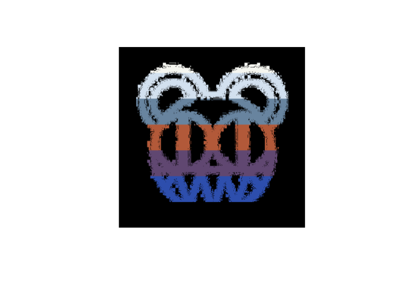
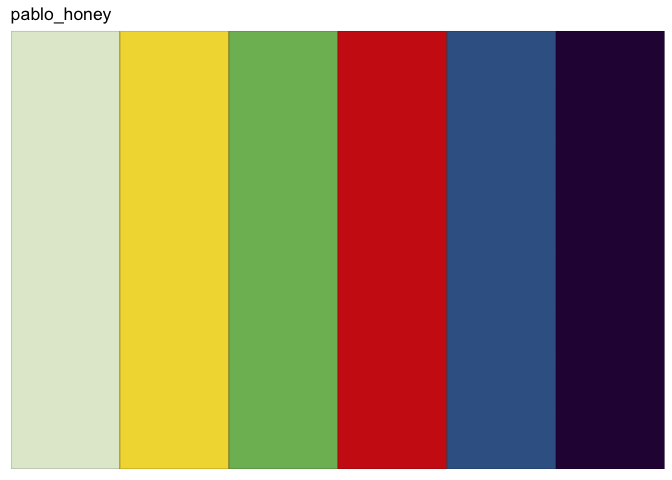

<!-- README.md is generated from README.Rmd. Please edit that file -->



# ggroove

There are two colors in my head. But we’ll need a few more to make
plots.

`ggroove` is a package of ggplot2 color palette functions based on album
art.

The first entry is from Radiohead

`scale_fill_radiohead_d(album = "kid_a")` will create a discreate fill
palette

``` r
library(ggplot2)
library(dplyr)
#> 
#> Attaching package: 'dplyr'
#> The following objects are masked from 'package:stats':
#> 
#>     filter, lag
#> The following objects are masked from 'package:base':
#> 
#>     intersect, setdiff, setequal, union
library(ggroove)
library(palmerpenguins)

penguins %>%
  ggplot(aes(body_mass_g,flipper_length_mm, fill =  bill_length_mm)) +
  geom_point(shape = 21, size = 4) +
  scale_fill_radiohead_c(album = "in_rainbows")
#> Warning: Removed 2 rows containing missing values (geom_point).
```



``` r


penguins %>%
  ggplot(aes(body_mass_g,flipper_length_mm, fill =  island)) +
  geom_point(shape = 21, size = 4) +
  scale_fill_radiohead_d(album = "king_of_limbs")
#> Warning: Removed 2 rows containing missing values (geom_point).
```


``` r

gapminder::gapminder %>%
  ggplot(aes(lifeExp, fill =  continent)) +
  geom_histogram(show.legend = TRUE, color = "black") +
  scale_fill_radiohead_d(album = "amnesiac") +
  theme_minimal()
#> `stat_bin()` using `bins = 30`. Pick better value with `binwidth`.
```


