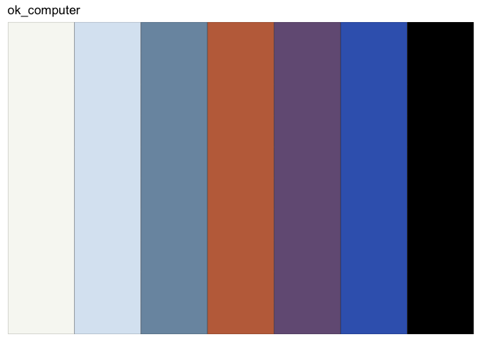
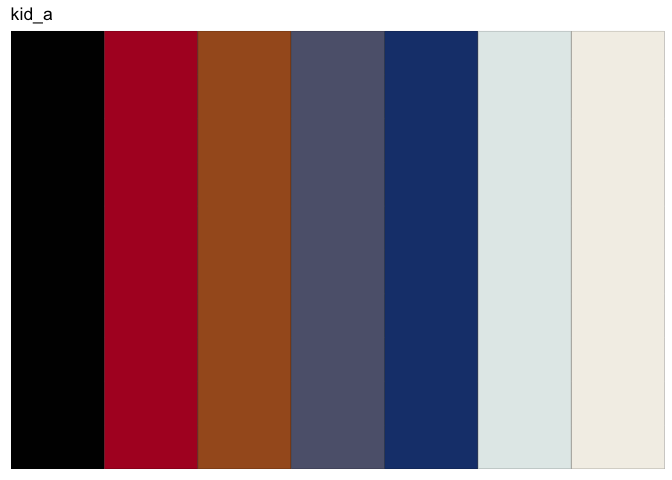
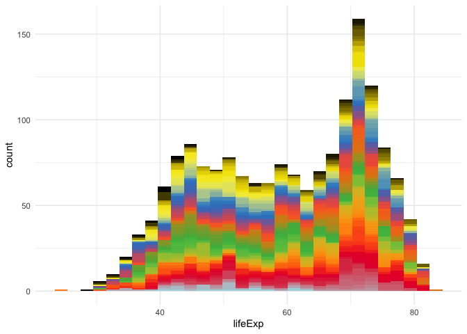
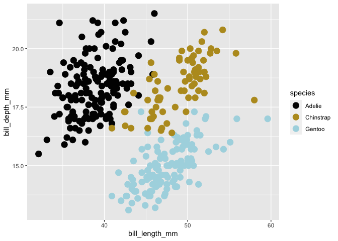

# ggroove 

<!-- README.md is generated from README.Rmd. Please edit that file -->

There are two colors in my head. But we’ll need a few more to make
plots.

`ggroove` is a package of color palettes and ggplot2 `scale_` functions
inspired by various album covers.

You can install the development version here

``` r
remotes::install_github("danovando/ggroove")
```

The first entries in the `ggroove` library come from Radiohead’s studio
LPs, which gets a series of specific functions in the form

`scale_fill_radiohead_d` and `scale_color_radiohead_c`, where `_d`
indicates discrete and `_c` indicates continuous.

As other artists are added, you can use color palettes from any included
album using

`scale_fill_album_d` and `scale_color_album_c`

If you’d like to submit a color palette to `ggroove`, see instructions
[here](https://danovando.github.io/ggroove/articles/contributing.html)

A quick note, there’s a lot of science out there on how to construct
color palettes that accurately convey information.

***These are not those.***

Color schemes that make for great album art are not necessarily designed
to convey information. I wouldn’t recommend using these for continuous
color scales, if you’ve got a few discrete categories rock on.

### Radiohead Palettes

### Pablo Honey

``` r
plot_palette(lp = "pablo_honey")
```


### The Bends

``` r
plot_palette(lp = "the_bends")
```


### OK Computer

``` r

plot_palette(lp = "ok_computer")
```



### Kid A

``` r

plot_palette(lp = "kid_a")
```



### Amnesiac

``` r
plot_palette(lp = "amnesiac")
```


### Hail to the Thief

``` r
plot_palette(lp = "hail_to_the_thief")
```


### In Rainbows

``` r
plot_palette(lp = "in_rainbows")
```


### The King of Limbs

``` r
plot_palette(lp = "the_king_of_limbs")
```


### A Moon Shaped Pool

``` r
plot_palette(lp = "a_moon_shaped_pool")
```


\#\# How to Use

We’ll use data from `gapminder` and `palmerpenguins` to demonstrate
`ggroove`.

### A continous colorramp

Here’s a continuous colorramp based on OK Computer (again, probably best
not to use this for continuous scales\!)

``` r
library(ggplot2)
library(dplyr)
#> 
#> Attaching package: 'dplyr'
#> The following objects are masked from 'package:stats':
#> 
#>     filter, lag
#> The following objects are masked from 'package:base':
#> 
#>     intersect, setdiff, setequal, union
library(ggroove)
library(palmerpenguins)
library(gapminder)

penguins %>% 
  ggplot(aes(bill_length_mm, bill_depth_mm, color = body_mass_g)) + 
  geom_point(size = 4) + 
  scale_color_radiohead_c(album = "ok_computer", direction = 1)
#> Warning: Removed 2 rows containing missing values (geom_point).
```



``` r


penguins %>% 
  ggplot(aes(bill_length_mm, bill_depth_mm, color = species)) + 
  geom_point(size = 4) + 
  scale_color_radiohead_d(album = "in_rainbows", direction = 1)
#> Warning: Removed 2 rows containing missing values (geom_point).
```



### A better use with discrete Fills

Here’s a more appropriate example showing discrete fills

``` r

gapminder::gapminder %>%
  ggplot(aes(lifeExp, fill =  country)) +
  geom_histogram(show.legend = FALSE) +
  scale_fill_radiohead_d(album = "in_rainbows") +
  theme_minimal() + 
  theme_dark()
#> `stat_bin()` using `bins = 30`. Pick better value with `binwidth`.
```


### … The Beatles\!

And one more with The Beatles\!

``` r

gapminder::gapminder %>%
  ggplot(aes(lifeExp, fill =  continent)) +
  geom_histogram(show.legend = TRUE, color = "black") +
  scale_fill_album_d(album = "the_white_album") +
  theme_minimal() + 
  theme_dark()
#> `stat_bin()` using `bins = 30`. Pick better value with `binwidth`.
```


